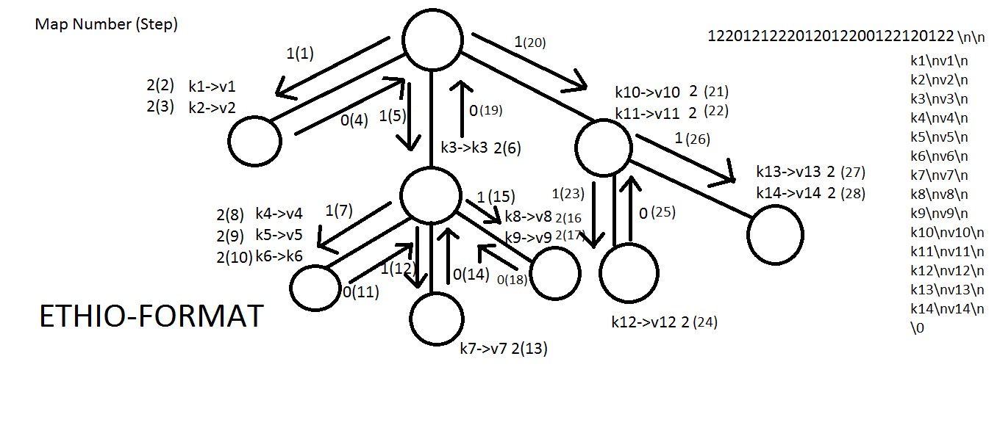

# EthioFormat

EthioFormat is a new, highly efficient data serialization format designed for high-performance applications, with a particular focus on gaming engines, AI, and large-scale data processing. Created by Tewodros Melaku (Tewodros Tech-Ethiopia), EthioFormat reflects Ethiopia's rich heritage while providing significant performance advantages over traditional formats like JSON and Protocol Buffers.

## Key Features
- **Text & Binary Versions**: EthioFormat provides both a human-readable text format and a highly optimized binary format for fast data serialization and deserialization.
- **Parallel Processing**: EthioFormat is designed to enable efficient parallel processing. It allows multiple threads/cores/machines to handle different parts of the data simultaneously, improving speed and scalability.
- **Optimized for Large Data**: Whether you are handling game data, training AI models, or processing social media content, EthioFormat is designed to scale efficiently, reducing the need for high computational power.

## Why EthioFormat?
EthioFormat is not just a data serialization format; it represents a vision for the future of data processing—one that values speed, efficiency, and adaptability. Its design allows you to:
- Access data quickly without searching for key-value pairs.
- Implement parallelism for large-scale applications.
- Optimize memory usage and reduce parsing time.
- Maintain flexibility in your data structure without compromising performance.

### **Introducing EthioFormat: A New Standard in Data Serialization**

#### **Introduction**

Hi, I'm **Tewodros Melaku**, also known as **Tewodros Tech-Ethiopia**. I’m a programmer with a deep interest in AAA games, AI, and how technology can shape a more **equitable and just world**. Although I have temporarily paused my programming career, I still maintain a strong **coding mindset** and an obsession with **innovation and problem-solving**. At the moment, my focus has shifted slightly towards the social side of tech, but I plan to combine these aspects in the near future. 

Today, I’m introducing **EthioFormat**, a **new method** of storing data for **serialization and deserialization**. It’s fast, simple, and efficient—designed to overcome many of the limitations present in existing formats. But before we dive into how EthioFormat works, let’s first explore the current landscape of data serialization formats.

---

#### **The Problem with Existing Serialization Formats**

Most developers are familiar with traditional serialization formats such as **JSON**, **Protocol Buffers (protobuf)**, and **XML**. These formats have been the go-to for many years, offering a way to easily store and transmit data. However, as technology advances, these formats reveal some significant shortcomings, especially when it comes to high-performance applications, such as:

- **Large-scale AI model training**  
- **Complex game data** in AAA titles  
- **Parallel processing** across distributed systems  

For example, JSON, while human-readable and widely used, tends to **consume excessive memory** and **slows down parsing** when handling large datasets. **Protocol Buffers** (protobuf), although more efficient than JSON in some cases, still requires complex parsing logic and **has its own set of limitations** with hierarchical data structures. Neither of these formats was specifically designed for the high-speed, parallelized systems required by today’s massive AI training environments or real-time game engines.

---

#### **Introducing EthioFormat**

**EthioFormat** is designed to fill these gaps in the current data serialization landscape. It is optimized for **parallel processing**, **large data sets**, and **fast parsing**, making it a perfect fit for use in **gaming engines**, **AI model training**, and high-performance applications.

The core of **EthioFormat** lies in its ability to store complex, hierarchical data structures in a **unique and efficient** way. It supports both **text** and **binary formats**, which are stored differently but maintain the same basic method of encoding and decoding. Here’s how it works:

1. **Data Structure & Hierarchy**  
   EthioFormat stores the **structure** and **content** of data separately:
   - The **header** contains a **map** or **guide** to the data structure—essentially a blueprint that describes how the data should be reconstructed.
   - The **content** is stored separately as **key-value pairs**.

2. **The Header**  
   The header in EthioFormat is a concise representation of the data structure, using a simple encoding system of **0s**, **1s**, and **2s**. Here’s how it works:
   - **1** signals the creation of a new **node** or **depth level** in the hierarchy (like adding a new level to a tree).
   - **2** signals the addition of a **new attribute**—a key-value pair to the current node that is pointed to.
   - **0** signals **backtracking**, returning to a **previous node** in the tree, so subsequent nodes can be added as **children** of the correct parent.

   This structure allows the header to **describe the tree's structure** and **the key-value pairs expectation of each node**, without including the actual data.

3. **The Content**  
   The content of the data (the actual **key-value pairs**) is stored **separately** from the structure, making it very efficient for parsing and accessing data. A pointer is used to **reference each key-value pair**, and when parsing begins, the system moves from one pair to the next based on the instructions in the header. As the parser encounters a **2** in the header, it moves to the next key-value pair and continues the process.

The extension of a text-version of EthioFormat is .eft and the extension of a binary-version of EthioFormat is .efb

---

#### **Why EthioFormat Matters**

Unlike traditional formats like JSON and Protocol Buffers, EthioFormat was created with **speed** and **parallelism** in mind. Whether you're building an AI model, managing complex game data, or transmitting large amounts of data across servers, EthioFormat optimizes **data serialization** and **deserialization** for **high-performance systems**. It’s designed for efficiency, scalability, and flexibility, solving many of the challenges that developers face today.

---

#### **The Unique Significance of EthioFormat**

Why did I name it **EthioFormat**? The name is inspired by my deep **love for Ethiopia**, my home country, and my belief that Ethiopia will **recover from its current challenges** and once again become a **light of the world**. Just like my country, EthioFormat is **unique** in its design and has the potential to stand out as a leader in the data serialization space.


#### **Understanding EthioFormat’s Core Design**

The core design of **EthioFormat** revolves around **separating structure from content** in a way that maximizes both speed and memory efficiency. Here’s how it works in practice:

1. **Reading the Data Structure**  
   As the header is being parsed, it provides the necessary instructions to **construct the data structure in memory**. Once the header has been fully read, **all key-value pairs** will also be ready, and the data structure is **fully reconstructed** in memory. This may seem tricky because it feels like the header and content are being parsed simultaneously, but there’s a clear sequence:

   - **Step 1**: The **header** is first **extracted and loaded into memory**. This is the map that tells us how the data is structured.
   - **Step 2**: Using the header as a guide, we **construct the nodes of the tree** and establish the **attributes** of each node.
   
   Alternatively, another approach would be to create the **skeleton of the tree** first, indicating how many attributes each node should have, and then populate the content later. This approach is particularly useful in **parallel processing scenarios**, which we’ll cover in more detail later.

2. **Storing and Parsing the Data**

   So, how is this data stored and parsed?

   EthioFormat comes in two **formats**:
   - **Text Version**  
   - **Binary Version**

   Let’s start with the **simpler text version**.

   The text version utilizes **delimiters** to separate each element of the raw data. These delimiters indicate where each component (e.g., a node, key, value, or backtrack) begins and ends. Here’s a brief overview of how this works:

   - **Delimiters** separate different types of data, such as nodes, attributes, and their values.
   - **Each part of the data**—whether it’s a **node**, an **attribute**, or a **value**—is clearly marked so that it can be easily extracted and parsed into the proper structure.

   In the case of the text version, parsing is straightforward: the system reads through the data, following the delimiters to reconstruct the hierarchy and content in memory.

---

#### **Parallel Processing with EthioFormat**

One of the **key advantages** of EthioFormat is its ability to handle **parallel processing** efficiently. Because the header and content are **separated**, it becomes easier to process different parts of the data simultaneously across multiple threads or machines. We’ll dive into this in more detail later, but here’s a quick preview of how this works:

- **Parallelism in Action**: The header can be processed separately, allowing one part of the system to construct the tree structure and another to begin populating the attributes and values. This separation of duties allows multiple cores or machines to handle different parts of the data without waiting for others to finish, significantly improving performance when dealing with large datasets or complex data structures.

---

#### **Binary Version: More Complex but Even Faster**

Next, we’ll talk about the **binary version** of EthioFormat, which is designed to be even **more efficient** than the text version. Unlike the text version that relies on delimiters, the binary version stores data in a compact binary format that eliminates the need for textual parsing, making it much **faster** and **more memory-efficient**.

- **Binary Parsing**: Instead of text delimiters, the binary version relies on **offsets** to describe the tree's individual nodes' key-value pairs. This allows the data to be parsed much more efficiently, making it ideal for high-performance applications where speed is critical.


#### **The Text Version of EthioFormat: Using Delimiters**

The **text version** of **EthioFormat** uses **two types of delimiters**: `\n` (newline) and `\0` (null terminate character, often used in C programming). These delimiters serve to indicate where one piece of data ends and another begins, allowing the format to parse and structure the raw data efficiently.

1. **Newline (`\n`) Delimiter**  
   The **newline character** marks the **end of a specific entry** in the raw data. When the parser encounters `\n`, it knows that it has finished reading one part of the field and can now move to the next.

2. **Null Terminator (`\0`) Delimiter**  
   The **null terminator** (`\0`) signals the **end of the raw data**, allowing the parser to stop reading once it encounters this character.

---

#### **Parsing the Raw Data**

The data structure, once parsed, is arranged into a **2D array** or **table**, which can then be easily worked with. Here's an example to illustrate this:

Consider the following table of data:

| Name    | Age | Sex |
|---------|-----|-----|
| Menelik | 34  | M   |
| Ruth    | 28  | F   |
| Ahmed   | 19  | M   |
| Hayat   | 25  | F   |

The raw data representation using the two delimiters (`\n` and `\0`) would look like this:

```
Menelik\n34\nM\nRuth\n28\nF\nAhmed\n19\nM\nHayat\n25\nF\n\0
```

Now, let’s walk through how the parser works on this raw data:

1. **Extracting Each Entry**:  
   The parser will go through the raw data, starting with "Menelik". When it encounters the `\n` delimiter, it recognizes that the first field has ended (i.e., the string "Menelik"). It then moves to the next piece of data, `34`, and continues the process.
   
2. **Storing the Data**:  
   After reading the name "Menelik", the parser moves to `34`, and then `M` after the second `\n`. It continues this process for each record in the table. Once the parser encounters the `\0` at the end, it stops.

3. **Field Count**:  
   While the delimiters tell the parser when to stop reading each field, they don’t specify how many fields there are. Therefore, the algorithm also needs to know how many fields it’s working with. In this case, we know there are 3 fields per record: `Name`, `Age`, and `Sex`. The algorithm will repeat the parsing process three times per entry, creating a record for each.

---

#### **Dealing with Special Characters in Data**

You might wonder: What happens if the **data itself** contains the delimiters (`\n` or `\0`)? Wouldn’t the parser mistakenly treat those characters as the end of a field or data?

This is where **encoding** comes into play. When we encode the data, we ensure that any special characters (like `\n` or `\0`) **won’t interfere with the delimiters**. By **encoding** those characters, we prevent the parser from interpreting them as delimiters. For example, if a field value contains a newline or null character, it will be **encoded** to a special form before being placed in the raw data. Once the data is parsed, we can **decode** the field back to its original form, safely including the special characters without confusing the parser.

But for now in the C++ implementation, it is assummed the input doesn't contain any **special characters**.

---

### Continuing the Explanation: **EthioFormat and Hierarchical Data**

So far, we’ve discussed the core design of EthioFormat, including the use of delimiters (`\n` and `\0`) and how they facilitate the construction of data structures. Now, let's build on that by looking at how **EthioFormat** handles complex and **hierarchical data**.

---

#### **Tying the Delimiters Back to EthioFormat’s Map**

In the previous sections, we saw how EthioFormat uses a **map structure** made up of 1s, 2s, and 0s to guide the construction of data. These values are a blueprint for the **hierarchical data structure**, directing how different levels of data should be nested or connected.

Now, let’s integrate the delimiter-based storage model we discussed earlier. While the **delimiter-based structure** is quite general, EthioFormat adapts it by enforcing a more specific **structure** for its use cases. In EthioFormat, each record consists of **two fields**: a **key** and a **value**. This works with the **2D array format** we discussed earlier, where:

1. The **key** represents the name or identifier of the data field (e.g., "Name", "Age").
2. The **value** holds the actual data associated with that key (e.g., "Menelik", 34).

In EthioFormat, this key-value pairing follows a **consistent structure** for all records—**with the exception of the first record**, which functions as the **header**. The header is special because it holds the **map** string (made up of 0s, 1s, and 2s) that guides the parsing and construction of the hierarchical data.

The second field in the header is empty for now but will play a crucial role later when we discuss how **parallel access** is handled in the text version.

Now, for the rest of the key-value pairs, they can be used to fill in the node's data. Once the header is parsed to get the tree-building map, that map is used to construct the tree with 1 being used to create a new node and go one level deeper making the current node the new child, 2 being used to add a key-value pair to the current node that we are focusing on, and 0 is used to backtrack changing the node we are focusing on to the parent of the current node. Now, let's see a simple example, on how it works:




Now, as you can see in the picture above, the arrow shows how the tree is constructed and the node that the arrow points to also shows attributes (key-value pairs). Also, you can also see the steps incrementing as it builds the tree, in the bracket, alongside the map number. For instance, As it moves from the root node to the first child, we see 1(1), which means the first step is creating the first child. After that, we can see: 2(2) and 2(3). This means the second and third step assign key-value pairs as attributes. It continues using the tree building map we discussed, in this case it is: 1220121222012012200122120122. So as it just found two 2s, it extracts two key-value pairs, which in this case are k1/v1 and k2/v2. And then the fourth map number is 0, which in this case makes it backtrack to the root node, in this case the parent node of the first child. Since it has red 2 attributes, it will start reading from the 3rd key-value pairs when it encounters a 2. 

Now, the tree above has been implemented in the ethioformat_text.cpp file.


Now, this is the beginning, here are what are remaining to complete this:
- Binary version
- Handling in parallel
- Dynamically adjusting length for serialization
---

### **Bringing It All Together: What EthioFormat Does Well**

1. **Efficient Data Representation**:  
   EthioFormat’s use of **delimiters and a map-based header** allows data to be parsed quickly and efficiently, without the need for complex overhead or additional tools. The map structure tells the parser exactly how to navigate the data, making the process streamlined.

2. **Hierarchical Data with Flexibility**:  
   The ability to represent complex, hierarchical data structures with a simple **key-value pairing** gives EthioFormat the flexibility needed for real-world applications. Whether it’s **JSON-like data** or **deeply nested structures**, EthioFormat ensures that each level is clearly defined and accessible.

3. **Scalability and Parallelism**:  
   As we’ll explore later, the **parallel access capabilities** in EthioFormat’s text version will further enhance its utility for **high-performance scenarios** like game engines and large-scale AI data training.

# Contact
For more information or inquiries, reach out to Tewodros Melaku via email: tewodrostechethiopia@gmail.com
